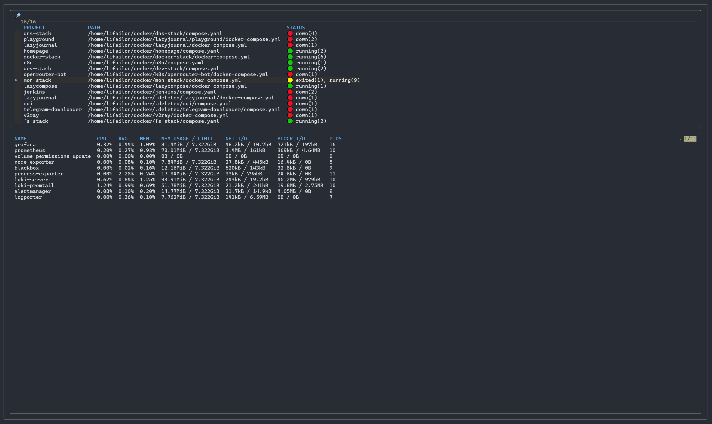
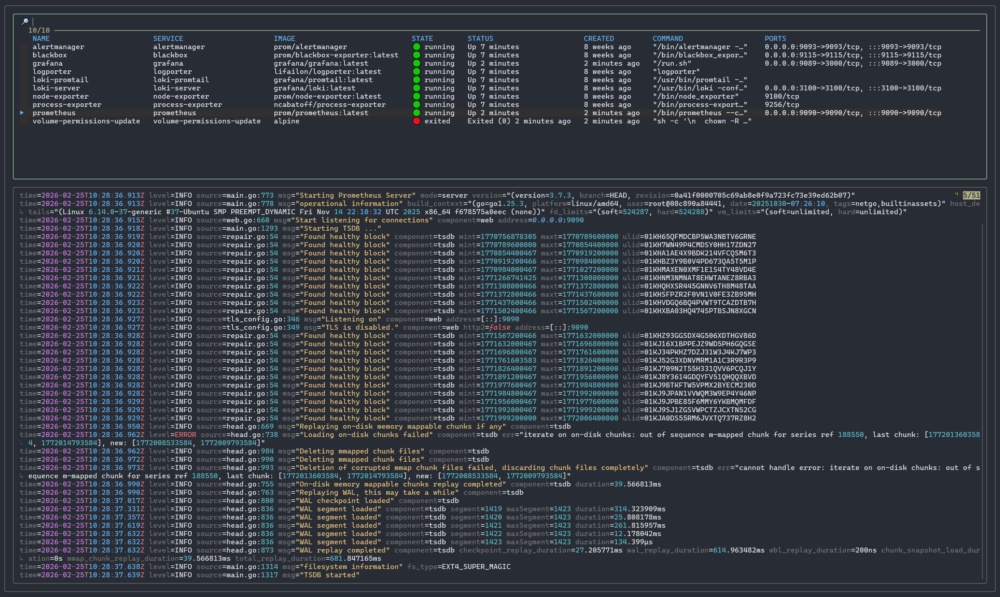
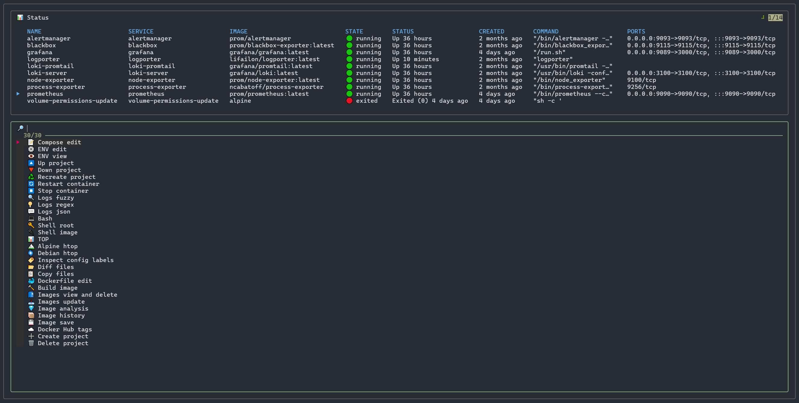

# lazycompose

Manage Docker Compose services from the terminal or browser.





I lacked a full-featured tool for managing containers using Docker Compose that covered all my needs. There is the excellent [Dockge](https://github.com/louislam/dockge) project, but it lacks features for managing individual services or conveniently viewing and filtering logs, for example, as in [Dozzle](https://github.com/amir20/dozzle).

Feature list:

- Search for all projects and quickly switch between them.
- Monitor statistics for all services in the selected project.
- View logs with colored output for each service.
- Display service status during command execution.

Default command management list:



## Configuration

The tool allows you to define your own set of commands or scripts for service management. If you have previously worked with [lazydocker](https://github.com/jesseduffield/lazydocker), this configuration will be familiar.

Configuration format:

```yaml
customCommands:
    # Name to display in the command list
  - name: 📝 Compose edit
    # Command to be executed
    command: micro $COMPOSE_FILE
    # Display command output in the current window
    attach: false
```

List of variables:

- `COMPOSE_FIND_DEPTH` - depth for searching compose files.
- `COMPOSE_PATH` - path to the directory with projects.
- `COMPOSE_FILE` - path to the compose file for the selected project.
- `COMPOSE_PROJECT_NAME` - name of the selected project.
- `COMPOSE_CONTAINER_NAME` - name of the selected container.
- `COMPOSE_SERVICE_NAME` - name of the selected service.
- `COMPOSE_IMAGE_NAME` - name of the image used in the selected service.

## Used tools

This project became possible by combining the capabilities of popular utilities.

The interface is entirely based on [fzf](https://github.com/junegunn/fzf), and the image includes the following auxiliary tools:

- [docker-cli](https://github.com/docker/cli) for container management.
- [docker-compose](https://github.com/docker/compose) for service management.
- [micro](https://github.com/micro-editor/micro) for editing `compose`, `env`, and `Dockerfile` files.
- [ttyd](https://github.com/tsl0922/ttyd) for launching the interface in the browser.
- [yq](https://github.com/mikefarah/yq) for parsing `yaml` configuration.
- [jq](https://github.com/jqlang/jq) for parsing service configurations and logs in `json` format.
- [fd](https://github.com/sharkdp/fd) for log filtering with regex support.
- [tailspin](https://github.com/bensadeh/tailspin) for colored log output.

## Install

To run the container, download the [docker-compose.yml](docker-compose.yml) file and use the image from [Docker Hub](https://hub.docker.com/r/lifailon/docker-web-manager):

```bash
mkdir lazycompose && cd lazycompose
curl -sSL https://raw.githubusercontent.com/Lifailon/lazycompose/refs/heads/main/docker-compose.yml -o docker-compose.yml
docker-compose up -d
docker attach lazycompose
```

The interface and file editor support mouse control.

To enable web mode, change the `TTYD_MODE` variable to `true` and go to `http://127.0.0.1:3333`
