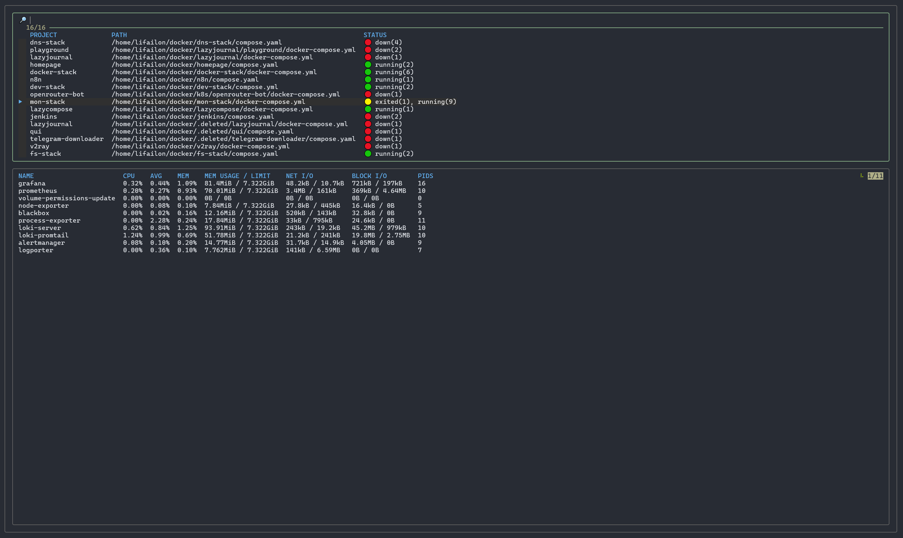
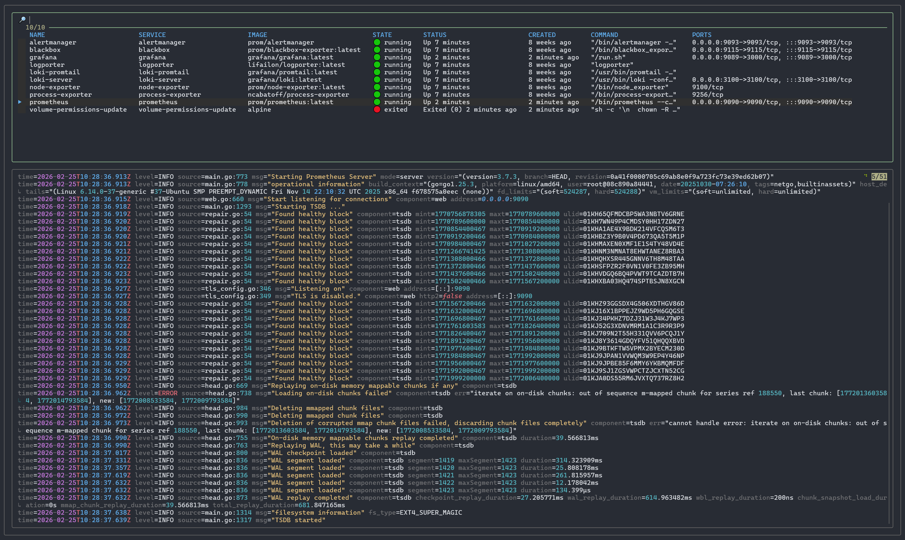
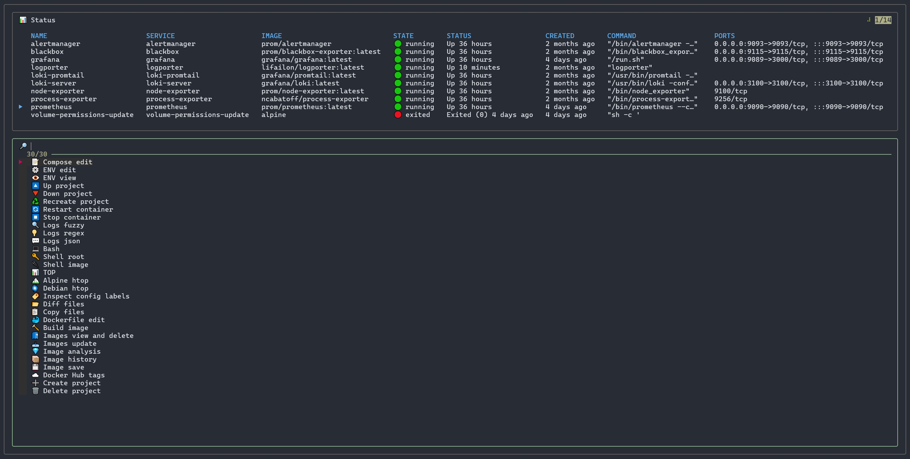

<h1 align="center">
  lazycompose 🐙
</h1>

<h4 align="center">
    <a href="README.md">English</a> | <strong>Russian</strong>
</h4>

Управление сервисами Docker Compose из терминала или браузера.





Мне не хватало полноценного инструмента для управления контейнерами с использованием Docker Compose, который бы покрывал все мои потребности. Существует прекрасный проект [Dockge](https://github.com/louislam/dockge), но у него отсутствуют функции для управление отдельными сервисами или удобного просмотра и фильтрации логов, например, как в [Dozzle](https://github.com/amir20/dozzle).

Список функций:

- Поиск всех проектов и быстрое переключение между ними.
- Мониторинг статистики по всем сервисам в выбранном проекте.
- Просмотр логов с покраской вывода для каждого сервиса.
- Отображение статуса работы сервисов во время выполнение команд.

Список команд для управления по умолчанию:



## Configuration

Инструмент предполагает самостоятельно определить набор команд или скриптов для управления сервисами. Если вы ранее работали с [lazydocker](https://github.com/jesseduffield/lazydocker), то такая кофнигурация вам будет уже знакома.

Формат конфигурации:

```yaml
customCommands:
    # Название для отображения в списке команд
  - name: 📝 Compose edit
    # Команда, которая будет выполнена
    command: micro $COMPOSE_FILE
    # Отображение вывода выполнення команды в текущем окне
    attach: false
```

Список переменных:

- `COMPOSE_FIND_DEPTH` - глубина для поиска файлов compose.
- `COMPOSE_PATH` - путь к директории с проектами.
- `COMPOSE_FILE` - путь к файлу compose для выбранного проекта.
- `COMPOSE_PROJECT_NAME` - название выбранного проекта.
- `COMPOSE_CONTAINER_NAME` - название выбранного контейнера.
- `COMPOSE_SERVICE_NAME` - название выбранного сервиса.
- `COMPOSE_IMAGE_NAME` - название образа, который используется в выбранном сервисе.

## Used tools

Этот проект стал возможен благодаря объединению возможностей популярных утилит.

Интерфейс целиком базируется на [fzf](https://github.com/junegunn/fzf), а образ включает в себя следующие вспомогательные инструменты:

- [docker-cli](https://github.com/docker/cli) для управления контейнерами.
- [docker-compose](https://github.com/docker/compose) для управления сервисами.
- [micro](https://github.com/micro-editor/micro) для редактирования файлов `compose`, `env` и `Dockerfile`.
- [ttyd](https://github.com/tsl0922/ttyd) для запуска интерфейса в браузере.
- [yq](https://github.com/mikefarah/yq) для парсинга `yaml` конфигурации.
- [jq](https://github.com/jqlang/jq) для парсинга конфигурации сервисов и логов в формате `json`.
- [fd](https://github.com/sharkdp/fd) для фильтрации логов с поддержкой регулярных выражений.
- [tailspin](https://github.com/bensadeh/tailspin) для покраски вывода логов.
- [dive](https://github.com/wagoodman/dive) для анализа образов в выбранных сервисах.

## Install

### Docker

Для запуска контейнера, загрузите файл [docker-compose](docker-compose.yml) и используйте образ из [Docker Hub](https://hub.docker.com/r/lifailon/lazycompose):

```bash
mkdir lazycompose && cd lazycompose
curl -sSL https://raw.githubusercontent.com/Lifailon/lazycompose/refs/heads/main/docker-compose.yml -o docker-compose.yml
docker-compose up -d
docker attach lazycompose
```

Интерфейс и файловый редактор поддерживают управление мышью.

Что бы включить веб режим, измените переменную `TTYD_MODE` на `true` и перейдите в `http://127.0.0.1:3333`

### Make

Для локальной установки используйте [Makefile](/Makefile) с предварительной установкой зависимостей в системе на базе Debian:

```bash
git clone https://github.com/Lifailon/lazycompose
cd lazycompose
make install
COMPOSE_PATH=/home/lifailon/docker lazycompose
```